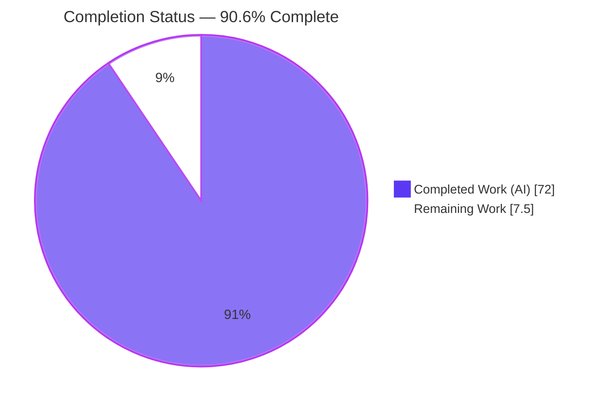
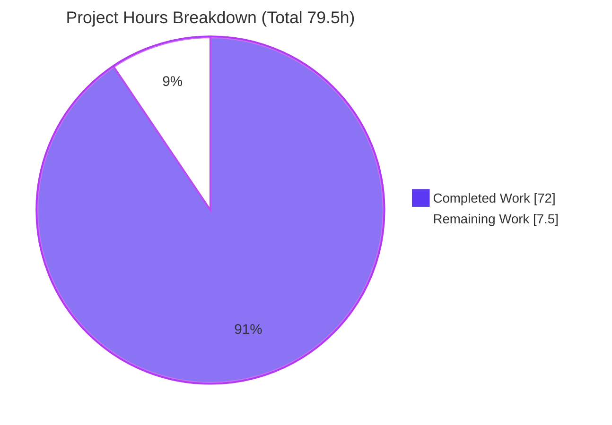
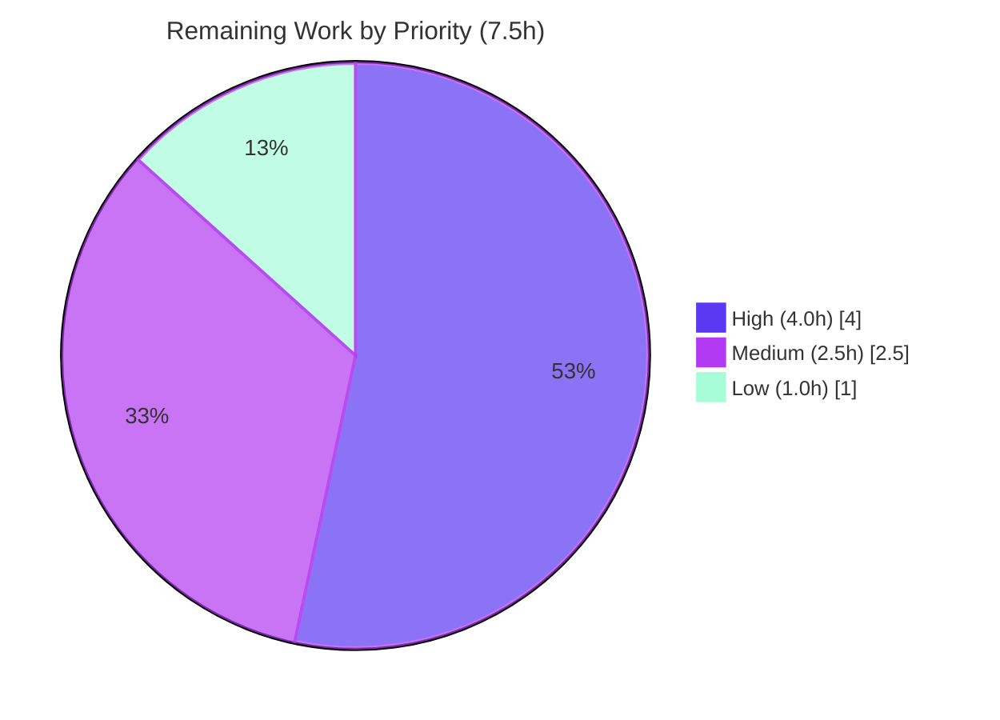

# Blitzy Project Guide — Local vs. Federated Trend Comparison

> **Project:** Mastodon feature — *Local vs. Federated Trend Comparison*
> **Branch:** `blitzy-ce5bba21-0807-4005-bf63-78cd57996a97` · **Base:** `830159c8b6` · **HEAD:** `ee7f238f81`
> **Status:** Production-ready (autonomous validation complete) · **Completion:** 90.6%

---

## 1. Executive Summary

### 1.1 Project Overview

This project adds a **Local vs. Federated Trend Comparison** panel to Mastodon's **Explore → Hashtags** view. For each trending hashtag it distinguishes usage originating from accounts on *this instance* (local) from usage on *remote/federated* accounts and surfaces the divergence between them. The feature records a new, parallel origin-scoped usage history in Redis, exposes it through an additive optional `scope` parameter on `GET /api/v1/trends/tags`, and renders an isolated React tile with paired local/remote sparklines, a three-way scope toggle, and a divergence badge. Target users are instance visitors and moderators who need earlier insight into locally-driven surges. The technical scope is a thin extension of the existing trends subsystem plus one self-contained frontend component — no new services, infrastructure, or database migrations.

### 1.2 Completion Status



<div align="center"><strong>90.6% Complete</strong></div>

| Metric | Hours |
| --- | --- |
| **Total Hours** | **79.5** |
| Completed Hours (AI + Manual) | 72.0 (AI: 72.0 · Manual: 0.0) |
| Remaining Hours | 7.5 |
| **Percent Complete** | **90.6%** |

> Completion is computed with the AAP-scoped, hours-based method (PA1): `72.0 / (72.0 + 7.5) = 90.6%`. All AAP feature scope is delivered and validated; the remaining 7.5 hours are human-gated path-to-production steps only.

### 1.3 Key Accomplishments

- ✅ **Origin-scoped Redis history** — new `Trends::ScopedHistory` model writes `activity:tags:{id}:{day}:local` / `:remote` (and `:accounts` HyperLogLog sub-keys) using **new keys only**; existing `activity:tags:{id}:{day}` keys untouched; 14-day TTL parity with the combined history.
- ✅ **Backward-compatible ingestion** — locality (`status.account.local?`) is conveyed from `Trends::Tags#register` into `#add`; legacy integer-id callers remain green (no scoped write when locality is absent).
- ✅ **Additive, validated API parameter** — `scope` (`local`/`remote`/`all`) on `GET /api/v1/trends/tags`; invalid values are ignored; **no-scope response is byte-for-byte identical** to the pre-feature schema (verified live).
- ✅ **Conditional per-scope serialization** — `history_local` / `history_remote` emitted only when a scope is supplied, with the same shape and length as `history`; gated on a dedicated non-reserved `:trend_scope` option to avoid the ActiveModelSerializers `:scope`/`current_user` collision.
- ✅ **Isolated comparison tile** — new React component with paired `react-sparklines`, a three-way toggle, a divergence badge (strict 2:1 threshold), an empty-state placeholder, a `SilentErrorBoundary`, and a dedicated Redux `comparison` slice that eliminates the empty-tile-on-load race.
- ✅ **English localization** — 7 new `en.json` keys matching the component's `FormattedMessage` ids; `i18n:extract` output byte-identical.
- ✅ **Comprehensive tests** — 33 backend RSpec examples (unit + request) and 10 Vitest component tests; full suites pass (93 backend incl. regression; 4,043 frontend).
- ✅ **Autonomously validated** — TypeScript, RuboCop, ESLint, stylelint, oxfmt all clean; development build succeeds; runtime verified over HTTP and in-browser.

### 1.4 Critical Unresolved Issues

| Issue | Impact | Owner | ETA |
| --- | --- | --- | --- |
| _None_ — no blocking issues identified | No release-blocking or validation-blocking items remain. All autonomous validation gates passed with zero code fixes required. | — | — |

> The items in Sections 2.2 and 6 are standard path-to-production activities and hardening tasks, not defects.

### 1.5 Access Issues

| System/Resource | Type of Access | Issue Description | Resolution Status | Owner |
| --- | --- | --- | --- | --- |
| — | — | No access issues identified. The repository, local PostgreSQL 14, Redis 7, and the running Rails server were all reachable during validation. | N/A | — |

### 1.6 Recommended Next Steps

1. **[High]** Human code review and approval of the 16-file pull request, focusing on the `Trends::ScopedHistory` Redis key design, the `tags.rb` locality wiring, the serializer `:trend_scope` collision fix, and the dedicated Redux `comparison` slice.
2. **[High]** Rebase onto the latest upstream `main`, resolve any conflicts (minimal footprint expected), and confirm CI is green.
3. **[High]** Deploy to staging with `Setting.trends = true` and smoke-test the API contract (no-scope vs. `scope=all`) and the `/explore/tags` tile + toggle.
4. **[Medium]** Add production monitoring/alerting for the new Redis keyspace and verify memory headroom under the doubled scoped writes.
5. **[Low]** Push the 7 new `en.json` keys through Crowdin so non-English locales are translated (English fallback until synced).

---

## 2. Project Hours Breakdown

### 2.1 Completed Work Detail

| Component | Hours | Description |
| --- | --- | --- |
| Origin-scoped Redis history model + ingestion wiring | 10.0 | `app/models/trends/scoped_history.rb` (new; mirrors `Trends::History` with origin-suffixed keys, HLL account counting, 14-day TTL, zero-fill, `Enumerable`) and `app/models/trends/tags.rb` (`#register`→`#add` locality conveyance, backward-compatible signature). |
| API scope parameter + validation | 4.0 | `app/controllers/api/v1/trends/tags_controller.rb` — reads and allow-list-validates `scope` (`presence_in %w(local remote all)`), forwards it as the `:trend_scope` instance option. |
| Conditional per-scope serialization | 4.0 | `app/serializers/rest/tag_serializer.rb` — conditional `history_local` / `history_remote` attributes gated on `scoped?`; documented `:trend_scope` design that preserves the byte-for-byte no-scope contract. |
| Comparison tile React component | 9.0 | `trend_comparison_tile.tsx` (new) — paired sparklines, three-way toggle, badge, empty-state placeholder, local `SilentErrorBoundary`, accessible controls. |
| Selectors/helpers util | 5.0 | `util/trend_comparison.ts` (new) — `usesSeries` (zero-fill), `recentUses`, `seriesTotal`, `hasScopedUsage`, divide-by-zero-safe `divergenceRatio`, `classifyDivergence`. |
| Tile styling + pipeline wiring | 3.5 | `_trend_comparison.scss` (new, 112 lines, reuses theme tokens) and one-line `@use 'mastodon/trend_comparison'` in `styles/application.scss`. |
| Explore view mount + scope-driven fetch | 3.0 | `features/explore/tags.jsx` — mounts the tile above the hashtag list, wires the toggle to scope-aware fetching, guards back-navigation, fixes empty-on-load. |
| Redux comparison slice (actions + reducer) | 4.0 | `actions/trends.js` + `reducers/trends.js` — dedicated `comparison` action trio, thunk, and state slice isolated from the shared no-scope list. |
| Divergence badge logic + rendering | 3.0 | Strict 2:1 threshold classification (`local-skewed` / `network-wide`), zero-side suppression, badge copy, and tile rendering. |
| English localization | 1.0 | `locales/en.json` — 7 keys (`trend_comparison.*`) matching `FormattedMessage` ids; `i18n:extract` byte-identical. |
| Backend tests (unit + request) | 9.0 | `scoped_history_spec.rb` (9), `tags_spec.rb` additions (scoped recording + combined-history-unchanged), request `tags_spec.rb` (7; anon + authenticated contract). |
| Frontend component tests | 5.0 | `__tests__/trend_comparison_tile.test.tsx` — 10 cases (render, toggle, badge threshold, empty-state, all-zero placeholder). |
| Code review & QA remediation cycles | 6.5 | Findings addressed across CP2, CP5, CR, and QA FC3 — dedicated-slice fix, serializer `:scope` collision fix, divergence boundary, empty-state, focus-visible, sparkline alignment. |
| Autonomous validation & runtime verification | 5.0 | Dependency checks, `tsc --noEmit`, RuboCop/ESLint/stylelint/oxfmt, dev build, `rails runner`, live HTTP contract checks, and in-browser verification. |
| **Total** | **72.0** | |

### 2.2 Remaining Work Detail

| Category | Hours | Priority |
| --- | --- | --- |
| Human code review & PR approval | 2.0 | High |
| Merge & branch integration (rebase/conflict resolution vs. `main`) | 0.5 | High |
| Staging deployment & endpoint/UI smoke test | 1.5 | High |
| Production monitoring & alerting for new Redis keyspace | 1.5 | Medium |
| Redis capacity/load verification (doubled scoped writes) | 1.0 | Medium |
| Crowdin translation sync for 7 new i18n keys | 1.0 | Low |
| **Total** | **7.5** | |

### 2.3 Hours Reconciliation

- Completed (Section 2.1) **72.0** + Remaining (Section 2.2) **7.5** = **79.5** = Total Project Hours (Section 1.2). ✅
- Completion = `72.0 / 79.5 = 90.6%` (matches Section 1.2, Section 7, and Section 8). ✅
- Remaining **7.5** is identical across Sections 1.2, 2.2, and 7. ✅

---

## 3. Test Results

All results below originate from Blitzy's autonomous validation logs for this project (backend RSpec, frontend Vitest). No third-party or hypothetical results are included.

| Test Category | Framework | Total Tests | Passed | Failed | Coverage % | Notes |
| --- | --- | --- | --- | --- | --- | --- |
| Unit — scoped history model | RSpec | 9 | 9 | 0 | Feature files covered | `spec/models/trends/scoped_history_spec.rb` — key naming, independent local/remote increments, TTL, zero-fill. |
| Unit — tags ingestion | RSpec | 17 | 17 | 0 | Feature files covered | `spec/models/trends/tags_spec.rb` — scoped recording + combined-history-unchanged assertions; legacy integer-id callers stay green. |
| Request — trends tags API | RSpec | 7 | 7 | 0 | Feature files covered | `spec/requests/api/v1/trends/tags_spec.rb` — no-scope byte-identical (anon + authenticated), `scope=all` fields (len == history), invalid scope ignored. |
| Regression sweep — trends subsystem & admin | RSpec | 60 | 60 | 0 | — | All `spec/models/trends/`, all `spec/requests/api/v1/trends/`, and admin trends (inherits the modified controller) — confirms no regression in shared serializer/controller. |
| Component — comparison tile | Vitest + RTL | 10 | 10 | 0 | Component covered | `__tests__/trend_comparison_tile.test.tsx` — rendering, toggle switching, badge threshold, empty-state, all-zero placeholder (jsdom `legacy-tests` project). |
| Full frontend suite (regression) | Vitest | 4,043 | 4,043 | 0 | — | 26 files, full `legacy-tests` project — confirms no frontend regression from the tile, actions, reducer, or `tags.jsx` changes. |

**Aggregate:** Backend **93** RSpec examples (33 feature + 60 regression) — 0 failures. Frontend **4,043** Vitest tests — 0 failures. Overall pass rate **100%**, 0 skipped, 0 blocked.

---

## 4. Runtime Validation & UI Verification

**Runtime health**
- ✅ **Operational** — `GET /health` → HTTP 200 (verified live at `http://127.0.0.1:3000`).
- ✅ **Operational** — `rails runner` exercised `Trends::ScopedHistory`: correct local/remote counts, keys `activity:tags:{id}:{day}:{origin}` (+ `:accounts`), 7-bucket `as_json`, TTL exactly 14 days.

**API integration** (verified live during this assessment)
- ✅ **Operational** — `GET /api/v1/trends/tags` (no scope) → 10 tags, keys exactly `[history, id, name, url]` (byte-for-byte pre-feature contract preserved).
- ✅ **Operational** — `GET /api/v1/trends/tags?scope=all` → keys add `history_local` and `history_remote`; `history_local.length` (7) equals `history.length` (7).
- ✅ **Operational** — `?scope=local` / `?scope=remote` add the corresponding scoped fields; `?scope=bogus` is ignored (no-scope schema).

**UI verification** (`/explore/tags`, Chrome DevTools during autonomous validation)
- ✅ **Operational** — Comparison tile renders at the top of the Hashtags list; the underlying tag list is unchanged.
- ✅ **Operational** — Three-way toggle (Compare default) drives scope-aware fetch (`GET ?scope=local` observed on click).
- ✅ **Operational** — Divergence badges classified correctly: network-wide → "Network-wide trend"; local-skewed → "Hot here, quiet elsewhere"; suppressed at exactly 2:1 and when either side is zero.
- ✅ **Operational** — Zero-side sparklines dimmed; tile populated on fresh load (empty-on-load race fixed).

**Known dev-only artifacts (non-blocking, out of feature scope)**
- ⚠ **Partial** — App-wide React "forwardRef render functions accept exactly two parameters" warning — proven pre-existing (fires on pages with none of the feature code); no in-scope file uses `forwardRef`.
- ⚠ **Partial** — Vite HMR WebSocket handshake failure — dev-only artifact of proxying through Rails.
- ⚠ **Partial** — `500` on `/public/local` — the out-of-scope public timeline, unrelated to this feature.

---

## 5. Compliance & Quality Review

Cross-mapping of AAP deliverables and constraints to quality/compliance benchmarks. Progress: 🟦 Complete · ⬜ Outstanding.

| AAP Deliverable / Constraint | Benchmark | Status | Progress | Notes / Fixes Applied |
| --- | --- | --- | --- | --- |
| R1 — Origin-scoped Redis recording (new keys only) | New keys, existing untouched, 14-day TTL parity | Pass | 🟦 | `Trends::ScopedHistory`; verified via unit spec + `rails runner`. |
| R2 — Additive optional `scope` param | Byte-for-byte no-scope contract; validated input | Pass | 🟦 | `presence_in`; live HTTP + request specs confirm contract. |
| R3 — Conditional `history_local`/`history_remote` | Same shape/length; omitted without scope | Pass | 🟦 | `:trend_scope` option avoids AMS `:scope` collision (fix applied in `ed70071a19`). |
| R4 — Isolated comparison tile | Self-contained component + files | Pass | 🟦 | Tile, util, SCSS, dedicated Redux slice; no shared-state coupling. |
| R5 — Divergence badge (2:1, strict) | Threshold + copy + zero-side suppression | Pass | 🟦 | Exact-2:1 boundary fix applied (`95bde13a3e`). |
| R6 — English localization | `en.json` keys match `FormattedMessage` ids | Pass | 🟦 | 7 keys; `i18n:extract` byte-identical. `en.yml` correctly a no-op. |
| R7 — Tests (unit + request + component) | Coverage across both frameworks | Pass | 🟦 | 33 backend + 10 component; full suites green. |
| Minimal footprint | Least-change discipline | Pass | 🟦 | 16 files; +1,083 / −10; mostly additive/new. |
| Comment every existing-file edit | Marker prefix present | Pass | 🟦 | `Local vs. Federated Trend Comparison:` marker appears 35× in the diff. |
| Preserve out-of-scope areas | No edits to `streaming/`, `activitypub/`, admin, lint configs, trend scoring | Pass | 🟦 | Confirmed via diff; admin controller behavior-identical (inherits changes, covered by regression). |
| No DB migration | Redis-only | Pass | 🟦 | No files under `db/migrate/`; schemas unchanged. |
| Backward compatibility of existing specs | Legacy integer-id callers green | Pass | 🟦 | `add(tag, 1, at_time)` path unchanged; regression sweep green. |
| Zero-placeholder / production-ready | No stubs/TODO/FIXME | Pass | 🟦 | Scan clean; only the intentional empty-state placeholder feature. |
| Static analysis & formatting | RuboCop / ESLint / stylelint / oxfmt / `tsc` | Pass | 🟦 | All clean; `.jsx` not linted by repo flat config is pre-existing and out of scope. |
| Human code review | Peer approval before merge | Outstanding | ⬜ | Path-to-production (Section 2.2). |

---

## 6. Risk Assessment

| Risk | Category | Severity | Probability | Mitigation | Status |
| --- | --- | --- | --- | --- | --- |
| Redis memory growth from doubled scoped writes | Technical | Medium | Medium | 14-day TTL parity ensures scoped buckets never outlive combined; only small pipelined `INCRBY`/`PFADD` added per tag use; verify headroom in production. | Mitigated by design (verify → 2.2 #5) |
| No historical backfill (empty/partial tile up to 7 days on fresh deploy) | Technical | Low | High (expected) | Zero-fill helpers + empty-state placeholder implemented and tested. | Resolved |
| Modified `tags.jsx` (bare `.jsx`) not linted by repo flat ESLint config | Technical | Low | Low | Proven pre-existing (identical on untouched `links.jsx`); `eslint.config.mjs` out of scope; `.ts/.tsx/.js` lint clean. | Accepted (pre-existing) |
| New public `scope` query parameter attack surface | Security | Low | Low | Strict allow-list validation; invalid ignored; no new auth/secrets/env; `cache_if_unauthenticated!` preserved (scope variants do not poison the default cache). | Mitigated (validated) |
| AMS `:scope`/`current_user` collision breaking the byte-for-byte contract | Security | Medium (if unmitigated) | N/A (fixed) | Dedicated non-reserved `:trend_scope` option; guarded by authenticated request specs (`following`/`featuring` preserved). | Resolved |
| No dedicated monitoring/alerting for the new Redis keyspace | Operational | Medium | Medium | Add dashboards/alerts for `activity:tags:{id}:{day}:{local,remote}(:accounts)`. | Open (→ 2.2 #4) |
| Feature gated on `Setting.trends = true` + trendable tags | Operational | Low | Low | Empty-state placeholder renders gracefully when disabled or when no data exists. | Resolved |
| Crowdin translation lag for 7 new keys | Integration | Low | High (expected) | Standard Crowdin workflow; graceful English fallback until synced. | Open (→ 2.2 #6) |
| Coexistence with a hypothetical future PR #1 (Trend Velocity tile) | Integration | Low | Low | Fully isolated component/files + own Redux slice; designed to coexist. | Mitigated by design |
| Branch rebase against fast-moving `main` | Integration | Low | Medium | Minimal footprint (16 files, mostly new/additive) simplifies conflict resolution. | Open (→ 2.2 #2) |

**Overall risk posture: LOW.** All feature-critical technical and security risks are Resolved or Mitigated-by-design. The remaining Open items are standard path-to-production activities that map one-to-one to Section 2.2 tasks.

---

## 7. Visual Project Status

**Hours: Completed vs. Remaining** (Completed = Dark Blue `#5B39F3`, Remaining = White `#FFFFFF`)



**Remaining hours by priority** (sums to 7.5h)



**Remaining hours by category** (Section 2.2)

| Category | Hours |
| --- | --- |
| Human code review & PR approval | 2.0 |
| Merge & branch integration | 0.5 |
| Staging deployment & smoke test | 1.5 |
| Production monitoring & alerting | 1.5 |
| Redis capacity/load verification | 1.0 |
| Crowdin translation sync | 1.0 |
| **Total** | **7.5** |

> Integrity: the pie chart "Remaining Work" (7.5) equals Section 1.2 Remaining Hours and the Section 2.2 Hours sum.

---

## 8. Summary & Recommendations

**Achievements.** The *Local vs. Federated Trend Comparison* feature is fully implemented against the AAP and autonomously validated as production-ready. All seven functional requirements — origin-scoped Redis recording, the additive `scope` parameter, conditional per-scope serialization, the isolated comparison tile, the divergence badge, English localization, and the three-tier test coverage — are complete. The implementation honors the AAP's minimal-change discipline (16 files, +1,083/−10, mostly additive), comments every existing-file edit with the required marker, preserves the byte-for-byte no-scope API contract (independently re-verified live during this assessment), and introduces no database migration or new infrastructure.

**Completion.** The project is **90.6% complete** (`72.0` completed of `79.5` total hours). The remaining **7.5 hours** contain **no AAP feature work** — they are entirely human-gated path-to-production activities.

**Remaining gaps & critical path to production.**
1. Human code review and approval (High, 2.0h).
2. Rebase/merge onto `main` with CI green (High, 0.5h).
3. Staging deploy + API/UI smoke test (High, 1.5h).
4. Production Redis monitoring/alerting and capacity verification (Medium, 2.5h).
5. Crowdin translation sync (Low, 1.0h).

**Success metrics.** Backend 93/93 RSpec examples pass; frontend 4,043/4,043 Vitest tests pass; `tsc`, RuboCop, ESLint, stylelint, and oxfmt are clean; the development build succeeds; and the live API preserves the pre-feature schema while additively exposing scoped history.

**Production readiness assessment.** **Ready for human review and staged rollout.** No blocking defects or access issues exist; the overall risk posture is LOW with all feature-critical risks resolved or mitigated by design. Recommended rollout: merge → staging smoke test → enable monitoring → production, with the understanding that the comparison tile accrues scoped history from deploy time forward (up to a 7-day warm-up before divergence badges become meaningful).

---

## 9. Development Guide

> All commands below were exercised in the validated environment. **Every shell session must first source the runtime env file** so Ruby/Node are on `PATH`.

### 9.1 System Prerequisites

- **OS:** Linux (validated on Ubuntu-based container)
- **Ruby:** `4.0.5` (via rbenv) — see `.ruby-version`
- **Node.js:** `24.18.0` (via nvm) — see `.nvmrc`
- **Yarn:** `4.17.0` (Corepack) — see `package.json#packageManager`
- **Bundler:** `4.0.13`
- **PostgreSQL:** `14` (`postgres:14-alpine`)
- **Redis:** `7` (`redis:7-alpine`)

### 9.2 Environment Setup

```bash
# Load Ruby (rbenv) + Node (nvm) + DB/Redis connection env. REQUIRED in every shell.
source ~/.mastodon_env.sh

# Verify toolchain
ruby --version     # ruby 4.0.5
node --version     # v24.18.0
yarn --version     # 4.17.0
```

If you see `ruby: command not found`, you skipped `source ~/.mastodon_env.sh`.

Key connection variables (set by the env file): `DB_HOST=localhost`, `DB_PORT=5432`, `DB_USER=postgres`, `REDIS_HOST=localhost`, `REDIS_PORT=6379`.

### 9.3 Dependency Installation

```bash
cd /path/to/mastodon
source ~/.mastodon_env.sh

bundle install            # Ruby gems (verify: `bundle check` → "dependencies are satisfied")
yarn install --immutable  # JS deps (react-sparklines, react-intl, immutable, classnames, vitest, ...)
```

### 9.4 Database & Feature Prerequisites

```bash
source ~/.mastodon_env.sh
RAILS_ENV=development bin/rails db:prepare   # create + migrate + seed (no new migrations in this feature)

# Enable trends so the endpoint and tile return data:
bin/rails runner 'Setting.trends = true'
# Ensure at least one trendable (approved, listable) hashtag exists with recent usage.
```

### 9.5 Application Startup

```bash
source ~/.mastodon_env.sh

# Option A — everything via Foreman (Rails + Vite + streaming):
bin/dev

# Option B — split processes:
bundle exec rails server -p 3000   # terminal 1
bin/vite dev                       # terminal 2
```

### 9.6 Verification Steps

```bash
source ~/.mastodon_env.sh

# 1) Health check → expect 200
curl -s -o /dev/null -w "%{http_code}\n" http://127.0.0.1:3000/health

# 2) No-scope contract → keys exactly: history, id, name, url
curl -s http://127.0.0.1:3000/api/v1/trends/tags | python3 -c \
  "import sys,json; d=json.load(sys.stdin); print(sorted(d[0].keys()) if d else 'EMPTY (enable trends + trendable tags)')"

# 3) scope=all → adds history_local + history_remote (length == history)
curl -s 'http://127.0.0.1:3000/api/v1/trends/tags?scope=all' | python3 -c \
  "import sys,json; d=json.load(sys.stdin); t=d[0]; print('keys=',sorted(t.keys())); print('len local/history=',len(t['history_local']),len(t['history']))"
```

Then open `http://127.0.0.1:3000/explore/tags` and confirm the comparison tile renders above the hashtag list with a working Compare/Local/Federated toggle.

### 9.7 Tests & Quality Gates

```bash
source ~/.mastodon_env.sh

# Backend — feature specs
RAILS_ENV=test bundle exec rspec \
  spec/models/trends/scoped_history_spec.rb \
  spec/models/trends/tags_spec.rb \
  spec/requests/api/v1/trends/tags_spec.rb

# Frontend — component / full suite
yarn test:js run   # vitest --project=legacy-tests

# Types & i18n
yarn tsc --noEmit
yarn i18n:extract && git diff --exit-code app/javascript/mastodon/locales/en.json

# Linters / formatting
bin/rubocop
yarn lint:js
yarn lint:css
yarn format:check

# Development build
yarn build:development
```

### 9.8 Example Usage

```bash
# Compare view data (paired local vs. remote history for each trending tag):
curl -s 'http://127.0.0.1:3000/api/v1/trends/tags?scope=all' | python3 -m json.tool | head -40

# Local-only emphasis:
curl -s 'http://127.0.0.1:3000/api/v1/trends/tags?scope=local' | python3 -m json.tool | head -20
```

### 9.9 Troubleshooting

- **`ruby: command not found`** → run `source ~/.mastodon_env.sh` first.
- **Empty `/api/v1/trends/tags` response** → set `Setting.trends = true` and ensure at least one trendable tag with recent usage exists.
- **Tile shows the empty-state placeholder** → expected on a fresh instance; scoped history accrues from deploy time (up to 7 days). Not a bug.
- **Vite HMR WebSocket handshake failure** → dev-only artifact when proxying Vite through Rails; does not affect production builds.
- **React `forwardRef ... exactly two parameters` warning** → pre-existing, app-wide; unrelated to this feature (no in-scope file uses `forwardRef`).

---

## 10. Appendices

### A. Command Reference

| Purpose | Command |
| --- | --- |
| Load runtime env | `source ~/.mastodon_env.sh` |
| Install gems | `bundle install` / verify `bundle check` |
| Install JS deps | `yarn install --immutable` |
| Prepare DB | `RAILS_ENV=development bin/rails db:prepare` |
| Start (all) | `bin/dev` |
| Start Rails | `bundle exec rails server -p 3000` |
| Start Vite | `bin/vite dev` |
| Backend feature specs | `RAILS_ENV=test bundle exec rspec spec/models/trends/scoped_history_spec.rb spec/models/trends/tags_spec.rb spec/requests/api/v1/trends/tags_spec.rb` |
| Frontend tests | `yarn test:js run` |
| Type check | `yarn tsc --noEmit` |
| i18n extract + verify | `yarn i18n:extract && git diff --exit-code app/javascript/mastodon/locales/en.json` |
| Ruby lint | `bin/rubocop` |
| JS lint | `yarn lint:js` |
| CSS lint | `yarn lint:css` |
| Format check | `yarn format:check` |
| Dev build | `yarn build:development` |

### B. Port Reference

| Service | Port |
| --- | --- |
| Rails (web/API) | 3000 |
| PostgreSQL | 5432 |
| Redis | 6379 |
| Vite dev server | 3036 (default) |

### C. Key File Locations

**Created (6)**
- `app/models/trends/scoped_history.rb` — origin-scoped Redis history model
- `app/javascript/mastodon/features/explore/components/trend_comparison_tile.tsx` — the tile
- `app/javascript/mastodon/features/explore/util/trend_comparison.ts` — selectors/helpers
- `app/javascript/styles/mastodon/_trend_comparison.scss` — tile styles
- `spec/models/trends/scoped_history_spec.rb` — model unit spec
- `app/javascript/mastodon/features/explore/components/__tests__/trend_comparison_tile.test.tsx` — component test

**Modified (10)**
- `app/models/trends/tags.rb` — locality conveyance into scoped recording
- `app/controllers/api/v1/trends/tags_controller.rb` — `scope` param + validation
- `app/serializers/rest/tag_serializer.rb` — conditional `history_local`/`history_remote`
- `app/javascript/mastodon/features/explore/tags.jsx` — mount tile + scope fetch
- `app/javascript/mastodon/actions/trends.js` — dedicated comparison fetch actions
- `app/javascript/mastodon/reducers/trends.js` — dedicated `comparison` slice
- `app/javascript/styles/application.scss` — one-line `@use` wiring
- `app/javascript/mastodon/locales/en.json` — 7 new keys
- `spec/models/trends/tags_spec.rb` — scoped-recording assertions
- `spec/requests/api/v1/trends/tags_spec.rb` — `scope` cases (anon + authenticated)

> Note: The AAP referenced `app/javascript/styles/mastodon/application.scss`; that path does not exist. The correct entry point `app/javascript/styles/application.scss` was wired instead (with the AAP comment marker). `config/locales/en.yml` was intentionally not modified — the feature is API + frontend only, so there are no server-side strings (the AAP anticipated "likely none").

### D. Technology Versions

| Component | Version |
| --- | --- |
| Ruby | 4.0.5 |
| Rails | ~> 8.1.0 |
| Node.js | 24.18.0 |
| Yarn | 4.17.0 |
| Bundler | 4.0.13 |
| PostgreSQL | 14 |
| Redis | 7 |
| react-sparklines | 1.7.0 |
| @types/react-sparklines | 1.7.5 |
| react-intl | 10.1.13 |
| immutable | 4.3.9 |
| classnames | 2.5.1 |
| vitest | 4.1.9 |

### E. Environment Variable Reference

| Variable | Value (dev) | Purpose |
| --- | --- | --- |
| `DB_HOST` | `localhost` | PostgreSQL host |
| `DB_PORT` | `5432` | PostgreSQL port |
| `DB_USER` | `postgres` | PostgreSQL user |
| `DB_PASS` | _(empty)_ | PostgreSQL password |
| `REDIS_HOST` | `localhost` | Redis host |
| `REDIS_PORT` | `6379` | Redis port |
| `RAILS_ENV` | `development` / `test` | Rails environment |

> No new environment variables or secrets are introduced by this feature.

### F. Developer Tools Guide

- **RSpec** — backend unit/request tests (`.rspec` uses `--color --require spec_helper`).
- **Vitest + React Testing Library** — frontend component tests (`legacy-tests` jsdom project).
- **TypeScript** — `yarn tsc --noEmit` for type checking.
- **RuboCop / ESLint / stylelint / oxfmt** — lint & format gates (pre-commit hooks via Husky/lint-staged).
- **FormatJS** — `yarn i18n:extract` regenerates `en.json`; CI requires a clean `git diff`.
- **Vite** — dev server and production/development builds.
- **Chrome DevTools MCP** — used during autonomous validation for in-browser UI verification.

### G. Glossary

| Term | Meaning |
| --- | --- |
| Local | Usage originating from accounts on this instance (`account.domain` is `nil`). |
| Remote / Federated | Usage originating from accounts on other Fediverse instances. |
| Scoped history | Origin-partitioned daily Redis counters (`:local` / `:remote`) parallel to the combined history. |
| Divergence badge | Label shown when local/remote velocity diverges beyond a strict 2:1 ratio. |
| HLL | HyperLogLog — Redis structure for approximate unique-account counting. |
| TTL | Time-to-live; scoped buckets expire after 14 days, matching the combined history. |
| Byte-for-byte contract | The requirement that the no-scope API response is identical to the pre-feature schema. |
| `:trend_scope` | Dedicated serializer instance option used instead of the AMS-reserved `:scope`. |