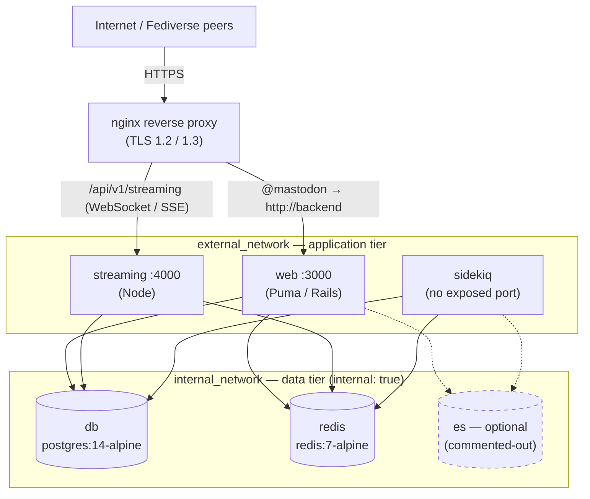

# Deployment & Service Topology

This document maps the production runtime services of this Mastodon monorepo — their container images, exposed ports, network-segment membership, and restart/health configuration — together with the inbound request-routing path that fronts them, reverse-engineered solely from `docker-compose.yml`, `Dockerfile`, `streaming/Dockerfile`, and `dist/nginx.conf`. The application service blocks documented here are defined at `Source: docker-compose.yml:L60-L119` and the reverse-proxy routing path at `Source: dist/nginx.conf:L6-L165`.

## A. Service Topology

The three long-running application services declared in `docker-compose.yml` `Source: docker-compose.yml:L60-L119` are listed below, one row each. Every value is read directly from the source files; no service, image, port, or network is inferred beyond what they define.

| Service | Image | Exposed port | Network segment(s) | Restart | Health check | Notes (base image / command) |
| --- | --- | --- | --- | --- | --- | --- |
| `web` | `ghcr.io/mastodon/mastodon:v4.6.2` `Source: docker-compose.yml:L63` | `127.0.0.1:3000:3000` — loopback-only `Source: docker-compose.yml:L73-L74`; image declares `EXPOSE 3000` `Source: Dockerfile:L414` | `external_network` + `internal_network` `Source: docker-compose.yml:L67-L69` | `always` `Source: docker-compose.yml:L64` | HTTP `/health` probe — `curl -s --noproxy localhost localhost:3000/health \| grep -q 'OK'` `Source: docker-compose.yml:L70-L72` | Command `bundle exec puma -C config/puma.rb` `Source: docker-compose.yml:L66`; base image `ruby:4.0.5-slim-trixie` `Source: Dockerfile:L16` `Source: Dockerfile:L21` `Source: Dockerfile:L25` |
| `streaming` | `ghcr.io/mastodon/mastodon-streaming:v4.6.2` `Source: docker-compose.yml:L87` | `127.0.0.1:4000:4000` — loopback-only `Source: docker-compose.yml:L97-L98`; image declares `EXPOSE 4000` `Source: streaming/Dockerfile:L109` | `external_network` + `internal_network` `Source: docker-compose.yml:L91-L93` | `always` `Source: docker-compose.yml:L88` | HTTP `/api/v1/streaming/health` probe — `curl -s --noproxy localhost localhost:4000/api/v1/streaming/health \| grep -q 'OK'` `Source: docker-compose.yml:L94-L96` | Command `node ./streaming/index.js` `Source: docker-compose.yml:L90`; base image `node:24-trixie-slim` `Source: streaming/Dockerfile:L13` `Source: streaming/Dockerfile:L15` `Source: streaming/Dockerfile:L17` |
| `sidekiq` | `ghcr.io/mastodon/mastodon:v4.6.2` — shares the `web` image `Source: docker-compose.yml:L106` | **None** — the service block declares no `ports:` key; it is a background worker reached only through the shared Redis queue `Source: docker-compose.yml:L103-L119` | `external_network` + `internal_network` `Source: docker-compose.yml:L113-L115` | `always` `Source: docker-compose.yml:L107` | Process probe (no HTTP port to curl) — `ps aux \| grep '[s]idekiq\ 8' \|\| false` `Source: docker-compose.yml:L118-L119` | Command `bundle exec sidekiq` `Source: docker-compose.yml:L109`; base image `ruby:4.0.5-slim-trixie` `Source: Dockerfile:L16` `Source: Dockerfile:L21` `Source: Dockerfile:L25` |

**Why the application ports bind to `127.0.0.1`:** `web` and `streaming` publish their ports on the loopback interface only `Source: docker-compose.yml:L73-L74` `Source: docker-compose.yml:L97-L98`, so neither is reachable directly from the internet; inbound traffic must arrive through the reverse proxy documented in Section B. `sidekiq` publishes no port at all — its service block declares no `ports:` key — so it can be driven only indirectly through the shared Redis queue `Source: docker-compose.yml:L103-L119`.

**Data tier (for completeness — not part of the application-service table above):** the two active stateful backends live exclusively on `internal_network`, so they are never exposed outside the compose network. `db` runs `postgres:14-alpine` `Source: docker-compose.yml:L7` on `internal_network` only `Source: docker-compose.yml:L9-L10`; `redis` runs `redis:7-alpine` `Source: docker-compose.yml:L20` on `internal_network` only `Source: docker-compose.yml:L21-L22`. An `es` (Elasticsearch) service is present in the file but **commented-out / optional**; were it uncommented as written it would join *both* `external_network` and `internal_network` and publish loopback port `127.0.0.1:9200:9200`, so it is not an internal-only service `Source: docker-compose.yml:L28-L58` `Source: docker-compose.yml:L43-L58`. `internal_network` is declared `internal: true`, which is what keeps `db` and `redis` private `Source: docker-compose.yml:L140-L141`.

## B. Inbound Routing (nginx)

`dist/nginx.conf` is the reverse proxy that fronts the loopback-bound services from Section A — it declares the `web`/`streaming` upstreams `Source: dist/nginx.conf:L6-L20` and proxies inbound requests to them `Source: dist/nginx.conf:L126-L165`. One row per `upstream` and `location` rule; the purpose column states *why* each rule exists rather than restating its directives.

| Route / location | Target (`service:port` or action) | Purpose (why) |
| --- | --- | --- |
| `upstream backend` | `127.0.0.1:3000` (the `web` Puma server) | Names the `web` app server so the location blocks can `proxy_pass http://backend` by a stable label. `Source: dist/nginx.conf:L6-L8` |
| `upstream streaming` | `127.0.0.1:4000` with `least_conn` | Long-lived streaming connections are sent to the instance with the fewest active connections so load stays even as connections accumulate. `Source: dist/nginx.conf:L10-L20` |
| `:80` → `/.well-known/acme-challenge/` | `allow all` (served over plain HTTP) | Lets an ACME client complete certificate validation before a TLS certificate exists. `Source: dist/nginx.conf:L29` |
| `:80` → `location /` | `return 301 https://…` | Forces every other plaintext request onto HTTPS. `Source: dist/nginx.conf:L30` |
| `:443` → `location /` | `try_files $uri @mastodon` (+ HSTS header) | Serves a matching static file straight from disk when one exists, otherwise hands the request to the Rails app; the HSTS header keeps clients pinned to TLS. `Source: dist/nginx.conf:L69-L72` |
| `:443` → `^~ /assets/`, `/avatars/`, `/emoji/`, `/headers/`, `/ocr/`, `/packs/`, `/sounds/` | Served by nginx with `Cache-Control: public, max-age=2419200, must-revalidate` | Serves these static asset trees directly from nginx with a four-week `must-revalidate` cache so the Rails app never has to serve them. `Source: dist/nginx.conf:L76-L116` |
| `:443` → `^~ /system/` | Served by nginx with `immutable` caching, `X-Content-Type-Options: nosniff`, and `Content-Security-Policy: default-src 'none'; form-action 'none'` | User-uploaded media is untrusted, so it is delivered with hardened headers that block MIME-sniffing and any script/form execution. `Source: dist/nginx.conf:L118-L124` |
| `:443` → `^~ /api/v1/streaming` | `proxy_pass http://streaming` with `proxy_buffering off`, `Upgrade`/`Connection` upgrade headers, and `tcp_nodelay on` | WebSocket/SSE connections need a persistent, unbuffered, low-latency channel — this is why streaming gets a dedicated upgrade path distinct from the buffered web path. `Source: dist/nginx.conf:L126-L141` |
| `:443` → `location @mastodon` | `proxy_pass http://backend` with `proxy_buffering on`, `proxy_cache CACHE` (`200`→7d, `410`→24h), and `proxy_cache_use_stale` | Caches dynamic backend responses and keeps serving stale content when the backend errors or times out, shielding clients from upstream failure. `Source: dist/nginx.conf:L143-L165` |
| `error_page 404 500 501 502 503 504` | `/500.html` | Presents one static error page for both client (404) and upstream (5xx) failures. `Source: dist/nginx.conf:L167` |

## C. Request-to-Runtime Diagram

*The application tier (`web`, `streaming`, `sidekiq`) attaches to both `external_network` and `internal_network`, while the active data tier (`db`, `redis`) is reachable only on `internal_network` (`internal: true`); the solid edges into `db`/`redis` follow each service's `depends_on` declarations, the dashed `es` node is drawn beside the data tier to mark the commented-out / optional Elasticsearch service — though as written that block would join *both* `external_network` and `internal_network` and publish loopback `127.0.0.1:9200:9200` rather than being internal-only `Source: docker-compose.yml:L43-L58` — and `sidekiq` carries no inbound proxy edge or published port because it is reachable only through the shared Redis queue. The `TLS 1.2 / 1.3` shown on the `nginx` node is the reverse proxy's configured `ssl_protocols`, which is why clients reach the loopback-bound services only over TLS. `Source: dist/nginx.conf:L38` `Source: docker-compose.yml:L67-L69` `Source: docker-compose.yml:L91-L93` `Source: docker-compose.yml:L113-L115` `Source: docker-compose.yml:L138-L141` `Source: docker-compose.yml:L75-L77` `Source: docker-compose.yml:L99-L101` `Source: docker-compose.yml:L110-L112` `Source: docker-compose.yml:L28-L58` `Source: docker-compose.yml:L103-L119`*

## D. Generalizing the Technique (Argo CD / Kubernetes / ECS)

The same reverse-engineering recipe transfers directly to orchestrator-managed deployments: read each compose service block's image, ports, networks, restart, and healthcheck the way one would read a Kubernetes `Deployment`'s container image and a `Service`/`Ingress`'s exposed ports and host/path routing, an Argo CD `Application`'s `source`/`destination`, or an ECS task definition's container and port mappings. Parsing the reverse-proxy `upstream`/`location` rules is the analogue of tracing an `Ingress` or load-balancer listener through to its backend target. Cross-referencing each `Dockerfile`'s `EXPOSE` and base-image lines mirrors inspecting a container image's declared ports and base layers in any of those systems. This repository contains no Kubernetes, Helm, or Argo CD manifests, so this note describes the technique only and was not run against any such artifact here.

> Companion docs from the same documentation pass: [feature / component map](feature-component-map.md) · [external integration map](external-integration-map.md) · module READMEs — [models](../app/models/README.md), [services](../app/services/README.md), [API](../app/controllers/api/README.md), [workers](../app/workers/README.md), [activitypub](../app/lib/activitypub/README.md).
